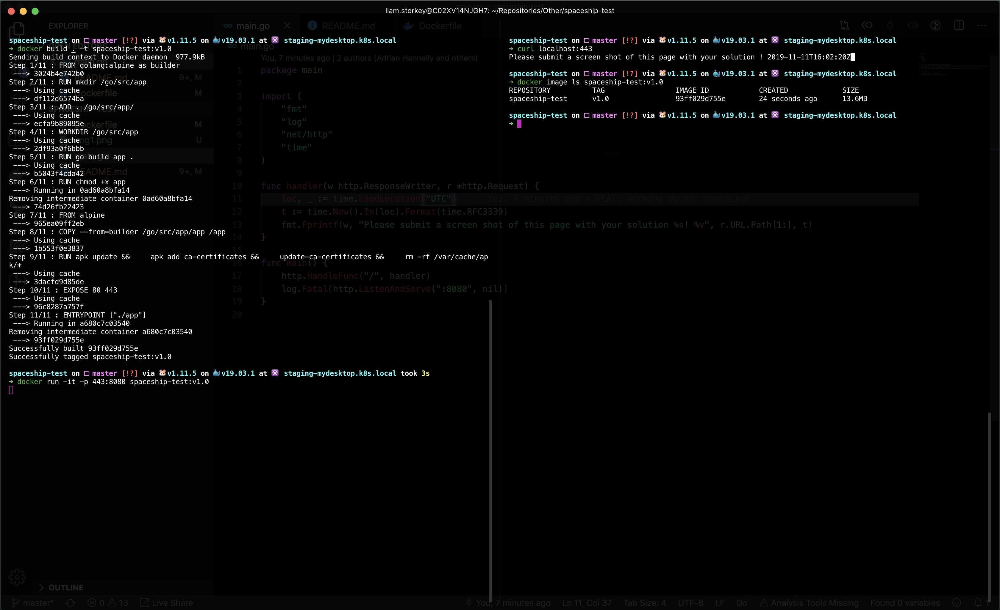

# DevOps-Lab-Pod

This instructions are really simple.  The source in this repo produces an broken docker container (or pod in K8) can you fix it?

Please submit your solution with the following 
* Screen Shots of the working problem 
* Any changes to you made to get it to work

It should take no more that 30 minutes to fix. 

## Completed test
**Screenshot**

### Changes
- Removed `-o` options in go build command
- Removed unnecessary curl apk package
- Exposed ports `80` and `443`
- Updated the Timezone in [main.go](main.go) to UTC

## How To
1. `docker build . -t spaceship-test:v1.0`

2. `docker run -p 443:8080 -p 80:8080 spaceship-test:v1.0`

3. `curl localhost:443`
